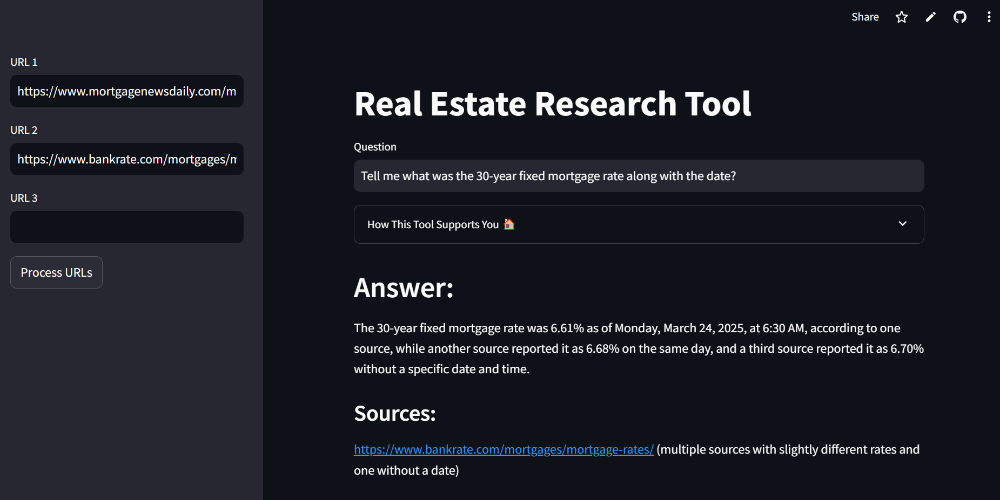

# 🏡 Real Estate Research Tool 🌟

Welcome to the **Real Estate Research Tool**! This Streamlit-based web app revolutionizes real estate research by leveraging **Retrieval-Augmented Generation (RAG)** with **LLaMA 3.3 (via Groq)**, **HuggingFace embeddings**, and **ChromaDB**. It slashes **LLM API costs by ~70%** and **research time by ~50%**, delivering precise, source-referenced answers to real estate questions based on user-provided URLs. Whether you’re curious about current mortgage rates or historical trends, this tool makes research fast, accurate, and user-friendly! 🚀

Built with **LangChain**, **Transformers**, and a focus on **system design**, this project is perfect for real estate professionals, analysts, or anyone seeking data-driven insights. Input URLs, ask questions, and get answers with source links in seconds! 😎

---

## 🎉 Try It Out!

Experience the tool live at:  
🔗 [Real Estate Research Tool Demo](https://real-estate-assistant-using-rag-vraj-dobariya.streamlit.app/)

Ask questions like:
- ❓ "What’s the current 30-year mortgage rate?"
- 📅 "What were mortgage rates on today?"

---

## 🌟 What Makes This Project Unique?

This tool stands out by combining advanced AI and efficient data retrieval to streamline real estate research. Here’s why it’s special:

- **URL-Driven RAG** 📑: Processes user-provided URLs (e.g., mortgage rate websites) using LangChain’s `UnstructuredURLLoader`, splitting content into chunks and storing embeddings in ChromaDB for fast, relevant retrieval.
- **Cost Efficiency** 💸: Reduces LLM API costs by ~70% through optimized HuggingFace `all-MiniLM-L6-v2` embeddings and ChromaDB’s lightweight vector storage.
- **Time Savings** ⏱️: Cuts research time by ~50% by automating data extraction and providing precise answers with source references.
- **Predefined & Custom URLs** 🔗: Offers curated URLs (e.g., Mortgage News Daily, Bankrate) for instant testing, plus support for up to three custom URLs.
- **LLaMA 3.3 Integration** 🤖: Uses Groq’s LLaMA 3.3 for natural, context-aware responses, ensuring accuracy and avoiding hallucination.
- **Streamlit UI** 🎨: Features a vibrant, emoji-rich interface with expandable guidance, making it accessible to all users.
- **Robust Error Handling** 🛠️: Validates URLs, handles processing errors, and provides clear feedback to ensure a smooth experience.

---

## 🎯 Industry Impact

This tool is a game-changer for the **real estate industry** by addressing key research challenges:

- **Faster Decision-Making**: Reduces research time by ~50%, enabling real estate professionals to quickly access mortgage rates, market trends, or policy details.
- **Cost Optimization**: Saves ~70% on API costs, making it a scalable solution for startups, agencies, or individual analysts.
- **Enhanced Accuracy**: Provides source-referenced answers, ensuring trust and reliability for critical decisions like mortgage planning or investment analysis.
- **User Accessibility**: The intuitive Streamlit UI and predefined URLs make it easy for non-technical users (e.g., homebuyers, brokers) to extract insights.
- **Scalability**: The modular RAG pipeline supports integration with diverse data sources, ideal for expanding into other domains (e.g., finance, insurance).
- **Team Collaboration**: Built with user feedback in mind, fostering iterative improvements and real-world applicability.

This project is perfect for real estate firms, financial advisors, or researchers looking to streamline data-driven decision-making with AI. 🏠

---

## 🏗️ Architecture

The tool’s architecture is designed for efficiency, scalability, and user-friendliness:



- **Frontend**: Streamlit app (`main.py`) with a colorful UI, sidebar for URL input, and expandable guidance.
- **Data Ingestion**: LangChain’s `UnstructuredURLLoader` (`rag.py`) scrapes and processes URLs, splitting content into 1000-character chunks.
- **Embedding & Storage**: HuggingFace’s `all-MiniLM-L6-v2` generates embeddings, stored in ChromaDB (`resources/vectorstore`) for fast retrieval.
- **Query Processing**: LLaMA 3.3 (via Groq) powers a `RetrievalQAWithSourcesChain` to generate answers with source URLs.
- **Error Handling**: Validates URLs using the `validators` library and provides status updates during processing.

---

## 🛠️ Setup & Execution

Follow these steps to run the tool locally:

1. **Clone the Repository**:
   ```bash
   git clone https://github.com/Vraj-Data-Scientist/real-estate-assistant-using-RAG
   cd real-estate-assistant-using-RAG
   ```

2. **Install Dependencies**:
   ```bash
   pip install -r requirements.txt
   ```

3. **Set Up Environment Variables**:
   Create a `.env` file in the project root with your Groq credentials:
   ```text
   GROQ_MODEL=llama-3.3-70b-versatile
   GROQ_API_KEY=<your-groq-api-key>
   ```

4. **Run the Streamlit App**:
   ```bash
   streamlit run main.py
   ```

5. **Interact with the Tool**:
   Open your browser (typically at `http://localhost:8501`) and:
   - Select predefined URLs (e.g., Mortgage News Daily) or add custom ones.
   - Click **Process URLs** to load data.
   - Ask questions like:
     - ❓ "What’s the current 30-year mortgage rate?"
     - 📅 "What was the mortgage rate on March 20, 2025?"

---

## 📋 Supported Queries

The tool answers real estate questions based on processed URLs. Examples include:

- **Mortgage Rates** 💰: "What’s the 30-year fixed mortgage rate today?"
- **Historical Data** 📅: "What were mortgage rates in January 2025?"
- **Market Insights** 📈: "Are mortgage rates expected to rise in 2026?"
- **Policy Questions** 📜: "What are the eligibility criteria for a first-time homebuyer loan?"

**Note**: Answers depend on the content of provided URLs. Text-rich, public websites work best, while image-based data, tables, or login-protected sites may not be processed.

---

## ⚠️ Things to Know

For the best experience, keep these in mind:
- **URL Quality** 🌐: Use text-rich, publicly accessible websites (e.g., Mortgage News Daily, Bankrate).
- **Limitations** 🚫: The tool cannot process images, tables, or login-protected content.
- **Predefined URLs** 🔗: Test instantly with curated URLs in the sidebar.
- **Processing Required** 🔄: Click **Process URLs** before asking questions.
- **URL Validation** ✅: Ensure URLs are valid (e.g., start with `https://`) to avoid errors.

---

## 🛠️ Technical Details

### Key Components
- **Streamlit (`main.py`)**: Powers the interactive UI with Open Graph metadata, sidebar URL inputs, and status updates.
- **LangChain (`rag.py`)**: Uses `UnstructuredURLLoader` to scrape URLs and `RecursiveCharacterTextSplitter` for chunking (1000 characters).
- **ChromaDB**: Stores embeddings in `resources/vectorstore` for efficient retrieval, using `all-MiniLM-L6-v2` embeddings.
- **LLaMA 3.3**: Via Groq, generates natural language answers with a `RetrievalQAWithSourcesChain`, including source URLs.
- **Error Handling**: Validates URLs, resets ChromaDB collections, and provides real-time feedback during processing.

### Optimization Techniques
- **Lightweight Embeddings**: Uses `all-MiniLM-L6-v2` for cost-efficient, high-performance embeddings.
- **Persistent Vector Store**: ChromaDB persists embeddings in `resources/vectorstore` for reuse.
- **Chunking Strategy**: Splits text into 1000-character chunks for optimal retrieval.
- **UUIDs for Documents**: Assigns unique IDs to document chunks for reliable storage and retrieval.
- **Fallback SQLite**: Uses `pysqlite3` with fallback to standard `sqlite3` for compatibility.

---

## 📚 Future Enhancements

- **Table & Image Support** 🖼️: Add parsing for tables and OCR for image-based data.
- **Expanded Domains** 🌐: Extend to other fields like finance or insurance.
- **Batch Processing** 📦: Support processing more than three custom URLs.
- **Advanced Query Parsing** 🧠: Handle complex or multi-part questions.
- **User Feedback Loop** 📝: Integrate feedback forms to refine responses.

---

## 🧑‍💻 About the Developer

Developed by **Vraj Dobariya**, a data scientist passionate about building AI-driven solutions for real-world challenges. Connect with me on:
- 📂 [GitHub](https://github.com/Vraj-Data-Scientist)
- 🔗 [LinkedIn](https://www.linkedin.com/in/vraj-dobariya/) *(Update with your LinkedIn if applicable)*

---

## 🙌 Acknowledgments

- **xAI**: For providing Groq and LLaMA 3.3 access.
- **LangChain**: For robust RAG and document processing tools.
- **HuggingFace**: For the `all-MiniLM-L6-v2` embedding model.
- **ChromaDB**: For efficient vector storage.
- **Streamlit**: For the intuitive UI framework.

---

⭐ **Star this repo** if you find it useful! Contributions and feedback are welcome! 😊

---


# 🏡 Real Estate Research Tool 🌟

Welcome to the **Real Estate Research Tool**! This Streamlit-based web app revolutionizes real estate research by leveraging **Retrieval-Augmented Generation (RAG)** with **LLaMA 3.3 (via Groq)**, **HuggingFace embeddings**, and **ChromaDB**. It slashes **LLM API costs by ~70%** and **research time by ~50%**, delivering precise, source-referenced answers to real estate questions based on user-provided URLs. Whether you’re curious about current mortgage rates or historical trends, this tool makes research fast, accurate, and user-friendly! 🚀

Built with **LangChain**, **Transformers**, and a focus on **system design**, this project is perfect for real estate professionals, analysts, or anyone seeking data-driven insights. Input URLs, ask questions, and get answers with source links in seconds! 😎

---

## 🌟 What Makes This Project Unique?

This tool stands out by combining advanced AI and efficient data retrieval to streamline real estate research. Here’s why it’s special:

- **URL-Driven RAG** 📑: Processes user-provided URLs (e.g., mortgage rate websites) using LangChain’s `UnstructuredURLLoader`, splitting content into chunks and storing embeddings in ChromaDB for fast, relevant retrieval.
- **Cost Efficiency** 💸: Reduces LLM API costs by ~70% through optimized HuggingFace `all-MiniLM-L6-v2` embeddings and ChromaDB’s lightweight vector storage.
- **Time Savings** ⏱️: Cuts research time by ~50% by automating data extraction and providing precise answers with source references.
- **Predefined & Custom URLs** 🔗: Offers curated URLs (e.g., Mortgage News Daily, Bankrate) for instant testing, plus support for up to three custom URLs.
- **LLaMA 3.3 Integration** 🤖: Uses Groq’s LLaMA 3.3 for natural, context-aware responses, ensuring accuracy and avoiding hallucination.
- **Streamlit UI** 🎨: Features a vibrant, emoji-rich interface with expandable guidance, making it accessible to all users.
- **Robust Error Handling** 🛠️: Validates URLs, handles processing errors, and provides clear feedback to ensure a smooth experience.

---

## 🎯 Industry Impact

This tool is a game-changer for the **real estate industry** by addressing key research challenges:

- **Faster Decision-Making**: Reduces research time by ~50%, enabling real estate professionals to quickly access mortgage rates, market trends, or policy details.
- **Cost Optimization**: Saves ~70% on API costs, making it a scalable solution for startups, agencies, or individual analysts.
- **Enhanced Accuracy**: Provides source-referenced answers, ensuring trust and reliability for critical decisions like mortgage planning or investment analysis.
- **User Accessibility**: The intuitive Streamlit UI and predefined URLs make it easy for non-technical users (e.g., homebuyers, brokers) to extract insights.
- **Scalability**: The modular RAG pipeline supports integration with diverse data sources, ideal for expanding into other domains (e.g., finance, insurance).
- **Team Collaboration**: Built with user feedback in mind, fostering iterative improvements and real-world applicability.

This project is perfect for real estate firms, financial advisors, or researchers looking to streamline data-driven decision-making with AI. 🏠

---

## 🏗️ Architecture

The tool’s architecture is designed for efficiency, scalability, and user-friendliness:


- **Frontend**: Streamlit app (`main.py`) with a colorful UI, sidebar for URL input, and expandable guidance.
- **Data Ingestion**: LangChain’s `UnstructuredURLLoader` (`rag.py`) scrapes and processes URLs, splitting content into 1000-character chunks.
- **Embedding & Storage**: HuggingFace’s `all-MiniLM-L6-v2` generates embeddings, stored in ChromaDB (`resources/vectorstore`) for fast retrieval.
- **Query Processing**: LLaMA 3.3 (via Groq) powers a `RetrievalQAWithSourcesChain` to generate answers with source URLs.
- **Error Handling**: Validates URLs using the `validators` library and provides status updates during processing.

---

## 🛠️ Setup & Execution

Follow these steps to run the tool locally:

1. **Clone the Repository**:
   ```bash
   git clone https://github.com/Vraj-Data-Scientist/real-estate-assistant-using-RAG
   cd real-estate-assistant-using-RAG
   ```

2. **Install Dependencies**:
   ```bash
   pip install -r requirements.txt
   ```

3. **Set Up Environment Variables**:
   Create a `.env` file in the project root with your Groq credentials:
   ```text
   GROQ_MODEL=llama-3.3-70b-versatile
   GROQ_API_KEY=<your-groq-api-key>
   ```

4. **Run the Streamlit App**:
   ```bash
   streamlit run main.py
   ```

5. **Interact with the Tool**:
   Open your browser (typically at `http://localhost:8501`) and:
   - Select predefined URLs (e.g., Mortgage News Daily) or add custom ones.
   - Click **Process URLs** to load data.
   - Ask questions like:
     - ❓ "What’s the current 30-year mortgage rate?"
     - 📅 "What was the mortgage rate on March 20, 2025?"

---

## 📋 Supported Queries

The tool answers real estate questions based on processed URLs. Examples include:

- **Mortgage Rates** 💰: "What’s the 30-year fixed mortgage rate today?"
- **Historical Data** 📅: "What were mortgage rates in January 2025?"
- **Market Insights** 📈: "Are mortgage rates expected to rise in 2026?"
- **Policy Questions** 📜: "What are the eligibility criteria for a first-time homebuyer loan?"

**Note**: Answers depend on the content of provided URLs. Text-rich, public websites work best, while image-based data, tables, or login-protected sites may not be processed.

---

## ⚠️ Things to Know

For the best experience, keep these in mind:
- **URL Quality** 🌐: Use text-rich, publicly accessible websites (e.g., Mortgage News Daily, Bankrate).
- **Limitations** 🚫: The tool cannot process images, tables, or login-protected content.
- **Predefined URLs** 🔗: Test instantly with curated URLs in the sidebar.
- **Processing Required** 🔄: Click **Process URLs** before asking questions.
- **URL Validation** ✅: Ensure URLs are valid (e.g., start with `https://`) to avoid errors.

---

## 🛠️ Technical Details

### Key Components
- **Streamlit (`main.py`)**: Powers the interactive UI with Open Graph metadata, sidebar URL inputs, and status updates.
- **LangChain (`rag.py`)**: Uses `UnstructuredURLLoader` to scrape URLs and `RecursiveCharacterTextSplitter` for chunking (1000 characters).
- **ChromaDB**: Stores embeddings in `resources/vectorstore` for efficient retrieval, using `all-MiniLM-L6-v2` embeddings.
- **LLaMA 3.3**: Via Groq, generates natural language answers with a `RetrievalQAWithSourcesChain`, including source URLs.
- **Error Handling**: Validates URLs, resets ChromaDB collections, and provides real-time feedback during processing.

### Optimization Techniques
- **Lightweight Embeddings**: Uses `all-MiniLM-L6-v2` for cost-efficient, high-performance embeddings.
- **Persistent Vector Store**: ChromaDB persists embeddings in `resources/vectorstore` for reuse.
- **Chunking Strategy**: Splits text into 1000-character chunks for optimal retrieval.
- **UUIDs for Documents**: Assigns unique IDs to document chunks for reliable storage and retrieval.
- **Fallback SQLite**: Uses `pysqlite3` with fallback to standard `sqlite3` for compatibility.

---

## 🎉 Try It Out!

Experience the tool live at:  
🔗 [Real Estate Research Tool Demo](https://real-estate-assistant-using-rag-vraj-dobariya.streamlit.app/)

Ask questions like:
- ❓ "What’s the current 30-year mortgage rate?"
- 📅 "What were mortgage rates on March 20, 2025?"

---

## 📚 Future Enhancements

- **Table & Image Support** 🖼️: Add parsing for tables and OCR for image-based data.
- **Expanded Domains** 🌐: Extend to other fields like finance or insurance.
- **Batch Processing** 📦: Support processing more than three custom URLs.
- **Advanced Query Parsing** 🧠: Handle complex or multi-part questions.
- **User Feedback Loop** 📝: Integrate feedback forms to refine responses.

---

## 🧑‍💻 About the Developer

Developed by **Vraj Dobariya**, a data scientist passionate about building AI-driven solutions for real-world challenges. Connect with me on:
- 📂 [GitHub](https://github.com/Vraj-Data-Scientist)
- 🔗 [LinkedIn](https://www.linkedin.com/in/vraj-dobariya/) *(Update with your LinkedIn if applicable)*

---

## 🙌 Acknowledgments

- **LangChain**: For robust RAG and document processing tools.
- **HuggingFace**: For the `all-MiniLM-L6-v2` embedding model.
- **ChromaDB**: For efficient vector storage.
- **Streamlit**: For the intuitive UI framework.

---

⭐ **Star this repo** if you find it useful! Contributions and feedback are welcome! 😊


---
